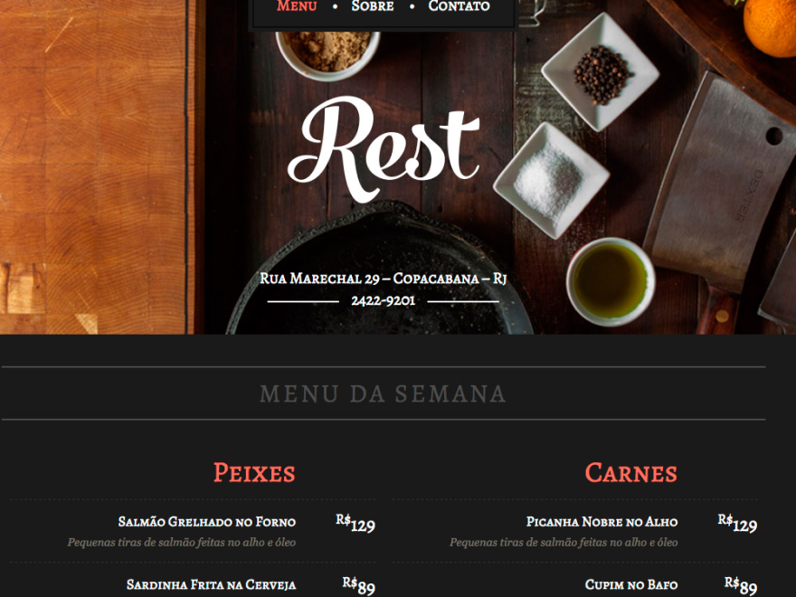

<h1 align="center">
	
</h1>

<p align="center">
	<a href="mailto:bortolettohenrique@gmail.com" target="_blank">
		
	</a>
	<a href="https://www.linkedin.com/in/henriquebortoletto/" target="_blank">
		
	</a>
</p>

## :rocket: Sobre

Rest é um projeto feito no curso `wordpress como cms` da `origamid` com um layout simples em html e css transformado em um tema para o <a href="https://worpdress.org" target="_blank">wordpress</a>,
usando algumas funções e hierarquias.

### :package: Primeiros passos

1. Baixar o <a href="https://worpdress.org" target="_blank">wordpress</a> e descompactar todos os arquivos em um servidor local ou dentro de uma hospedagem.

2. Criar um banco de dados no seu phpmyadmin do seu serviço para o wordpress ter acesso a essa base, para isso precisará criar um(a):

- `Nome do banco`

- `Usuário do banco`

- `Senha do banco`

3. Acessar a endereço do site (https://localhost) do servidor onde está o projeto e iniciar os passos de instalação colocando as credenciais do banco
   definidos anteriormente.

4. Criar um usuário e senha para logar no painel do dashboard.

5. Clonar o repositório com `git clone` colocando todos esse arquivos dentro da estrutura do wordpress, no caminho até themes.

```txt
/wp-content/themes/rest
```

6. Com os arquivos dentro de themes, basta ativá-lo o tema dentro do painel do <a href="https://worpdress.org" target="_blank">wordpress</a> em

```txt
Aparência > Temas > Ativar Tema.
```

7. Para o funcionamento do tema é preciso especificar qual página deve ser renderizado como página estática, basta ir em

```txt
Configurações > Leitura
```

8. Selecionar o item `Uma página estática (selecionar abaixo)` e em `Página Inicial` escolher a opção `Menu da Semana`, e o tema rest já estará ativo

Feito por :purple_heart: by [Henrique Bortoletto](https://github.com.br) :wave:
